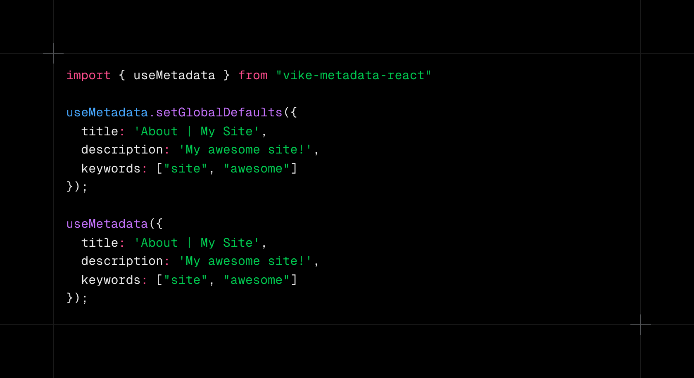

# vike-metadata

<div align="center">
  
</div>

<div>
  <table>
    <tr>
      <td align="center">
      React
      </td>
      <td align="center">
      Solid
      </td>
      <td align="center">
      Vue
      </td>
    </tr>
    <tr>
      <td align="center">
        <a href="https://www.npmjs.com/package/vike-metadata-react" target="_blank">
          </img></a>
        </img>
      </td>
      <td align="center">
        <a href="https://www.npmjs.com/package/vike-metadata-solid" target="_blank">
          </img></a>
        </img>
      </td>
      <td align="center">
        <a href="https://www.npmjs.com/package/vike-metadata-vue" target="_blank">
          </img></a>
        </img>
      </td>
    </tr>
  <table>
</div>

<div align="center">
  </img>
    </img>
</div>

🪝 A hook to manage metadata for your Vike + React/Solid/Vue app. Kinda like Next-SEO or React Helmet but for Vike and in a simple hook.

## Features

- [x] ☁️ Lightweight (minified & no extra dependencies).
- [x] 😻 Typesafe, repeatable, and pleasant DX for managing meta tags.
- [x] ❇️ Similar API to Next.js's [Metadata API](https://nextjs.org/docs/app/api-reference/functions/generate-metadata#metadata-object).
- [x] ⚒️ Made for Vike + React/Solid/Vue.
- [x] 🚀 Built on top of `useConfig` (a universal hook in Vike).

## Quick start

Install it:

```bash
npm i vike-metadata-react # react
npm i vike-metadata-solid # solid
npm i vike-metadata-vue # vue
```

### Get Started

1. Configure defaults

```tsx
// In your app's entry point, usually layout.
import { useMetadata } from 'vike-metadata-solid';

useMetadata.setGlobalDefaults({
  title: 'Vike + Solid',
  description: 'Demo showcasing Vike + Solid',
  viewport: {
    width: 'device-width',
    initialScale: 1,
  },
});

export function RootLayout(props) {
  // ...
}
```

2. Use in your pages

Adding defaults does not add the metadata to the page. But this part does. So if you don't use `useMetadata` on a page the tags will not be rendered at all. We don't use the cumulative approach like Next.js does.

```tsx
export function Page() {
  useMetadata({
    title: getTitle('About'),
    description: 'Learn about why this template is cool.',
  });

  // ...
}
```

### FAQs

- **It doesn't work on my Vike app.** Given that most Vike apps are built very granularly different from each other, you might have configured your app differently. `vike-metadata-*` expects the following practices if you choose to adopt this into your project:
  - React|Vue|Solid: Must be using `vike-react` or `vike-vue` or `vike-solid`, custom vike plugins are not supported (yet).
  - React|Vue|Solid: In `+config.ts`, do not use `Head` or `title`.
  - React|Vue|Solid: Do not use `+Head.tsx` or `+title.ts` either.
  - React: In `+config.ts`, `stream: true`.
- **Is this a zero-cost abstraction?** Most abstractions aren't. This technically does parses the typescript data shape into actual metatags and a lot of IF statements to render them or not, so that might be the "very, very" small cost here? Obviously laying out your metatags by yourself would be computationally cheaper, but I haven't really tested the overhead. Although, I'd choose still this over laying it out myself just for the DX. In most cases, this is what Next.js's Metadata API does too.
- **How to do Template Strings?** If you're looking for something like `%s | My Site`, just make a utility function like:

  ```ts
  const TITLE_TEMPLATE = '%s | My Site';
  export function getTitle(title: string) {
    return TITLE_TEMPLATE.replace('%s', title);
  }
  ```

- **How to do dynamic meta tags (e.g. title)?** Just use `useData` or `usePageContext` along with `useMetadata`. For instance:

  ```tsx
  import { useMetadata } from 'vike-metadata-solid';
  import { useData } from 'solid-start';

  export function Page() {
    const movie = useData<{ title: string }>();

    useMetadata({
      title: movie.title,
    });

    // ...
  ```
